# 虎彩信息中心创新研发部新人指引-前端部分

## 1,web前端开发规范
### 1.1,CSS书写规范
* 待完善
### 1.2,javaScript书写规范
#### 1.2.1 命名规范
* 常量名
    >全部大写并单词间用下划线分隔<br /> 
    >如：CSS_BTN_CLOSE、TXT_LOADING
* 对象属性或者方法名
    >小驼峰式<br /> 
    >如：init、bindEvent、updatePosition<br />
    >示例：<br/>
``` 
    Dialog.prototype = {
        init: function () {},
        bindEvent: function () {},
        updatePosition: function () {}
        …
    }; 
```
* 类名（构造器）
    >小驼峰式但首字母大写 <br/>
    >如：Current、DefaultConfig
* 函数名
    >小驼峰式 <br/>
    >如：current()、defaultConfig()
* 变量名
    >小驼峰式 <br/>
    >如：current、defaultConfig

#### 1.2.2 代码格式
* "()"前后需要跟空格
* "="前后需要跟空格
* ","后面需要跟空格
* JSON对象需格式化对象参数
* if、while、for、do语句的执行体用"{}"括起来
    >"{}"格式如下。
```
    if (a==1) {
        //代码
    };
```
* 避免额外的逗号。
    >var arr = [1,2,3,];
* for-in循环体中必须用hasOwnProperty方法检查成员是否为自身成员，避免来自原型链上的污染。
* 使用严格的条件判断符。用===代替==，用!==代替!=，避免掉入==造成的陷阱。
    >在条件判断时，这样的一些值表示false。<br/>
    >null, undefined与null相等, 字符串'', 数字0, NaN
* 在==时，则会有一些让人难以理解的陷阱。
    ```
    (function () {
        var undefined;
        undefined == null; // true
        1 == true; //true
        2 == true; // false
        0 == false; // true
        0 == ''; // true
        NaN == NaN;// false
        [] == false; // true
        [] == ![]; // true
    })();

* 对于不同类型的 == 判断，有这样一些规则，顺序自上而下：
    >undefined与null相等<br/>
    >一个是number一个是string时，会尝试将string转换为number<br/>
    >尝试将boolean转换为number<br/>
    >尝试将Object转换成number或string
* 而这些取决于另外一个对比量，即值的类型，所以对于0、空字符串的判断，建议使用===
* 以下的类型对象不使用new 构造
    ```
    new Number
    new String
    new Boolean
    new Object //用{}代替
    new Array //用[]代替
* 引用对象成员用obj.prop代替obj["prop"]，除非属性名是变量。
* 从number到string的转换。
    ```
    /** 推荐写法*/
    var a = 1;
    typeof(a); //"number"
    console.log(a); //1
    var aa=a+'';
    typeof(aa); //"string"
    console.log(aa); //'1'
    /** 不推荐写法*/
    new String(a)或a.toString()

* 从string到number的转换，使用parseInt，必须显式指定第二个参数的进制。
    ``` 
    /** 推荐写法*/
    var a = '1';
    var aa = parseInt(a,10);
    typeof(a); //"string"
    console.log(a); //'1'
    typeof(aa); //"number"
    console.log(aa); //1
* 从float到integer的转换。
    ```
    /** 推荐写法*/
    Math.floor/Math.round/Math.ceil
    /** 不推荐写法*/
    parseInt
* 字符串拼接应使用数组保存字符串片段，使用时调用join方法。避免使用+或+=的方式拼接较长的字符串，每个字符串都会使用一个小的内存片段，过多的内存片段会影响性能。
    ```
    /**推荐的拼接方式array的push、join*/
    var str=[],
        list=['测试A','测试B'];
    for (var i=0 , len=list.length; i < len; i++) {
        str.push( '<div>'+ list[i] + '</div>');
    };
    console.log(str.join('')); //<div>测试A</div><div>测试B</div>
    /** 不推荐的拼接方式+=*/
    var str = '',
        list=['测试A','测试B'];
    for (var i = 0, len = list.length; i< len; i++) {
        str+='<div>' + list[i] + '</div>';
    };
    console.log(str); //<div>测试A</div><div>测试B</div>

* 尽量避免使用存在兼容性及消耗资源的方法或属性。
    >不要使用with，void，evil，eval_r，innerText


### 1.2,CSS书写规范

## 2,VueJS前端开发环境
### 1,Node.js安装及环境配置
* 安装环境
    > * 本机系统：Windows 7（64位）<br/>
    > * Node.js：v8.11.3LTS（64位）
* 3.3.2.1.2安装Node.js步骤
    > * 下载对应你系统的Node.js版本:https://nodejs.org/en/download/<br/>
    > * 选安装目录进行安装<br/>
    > * 测试
* 前期准备
    > * Node.js简介<br/>
    简单的说 Node.js 就是运行在服务端的 JavaScript。Node.js 是一个基于 Chrome V8 引擎的 JavaScript 运行环境。Node.js 使用了一个事件驱动、非阻塞式 I/O 的模型，使其轻量又高效。Node.js 的包管理器 npm，是全球最大的开源库生态系统。
    > * 下载Node.js<br/>
    打开官网下载链接:https://nodejs.org/en/download/ 我这里下载的是node-v8.11.3-x64.msi,如下图：
    >
* 开始安装
    >下载完成后，双击“node-v8.11.3-x64.msi”，开始安装Node.js点击【Next】按钮。
    ><br/>
    ><br/>
    >勾选复选框，点击【Next】按钮<br/>
    ><br/>
    >点击【Next】按钮<br/>
    >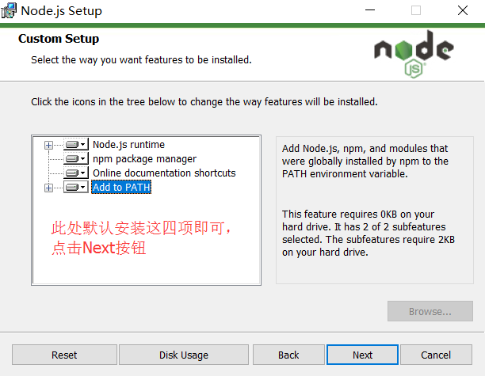<br/>
    >安装完后点击【Finish】按钮完成安装<br/>
    ><br/>
    >至此Node.js已经安装完成，可以先进行下简单的测试安装是否成功了， 在键盘按下【win+R】键，输入cmd，然后回车，打开cmd窗口。<br/>
    >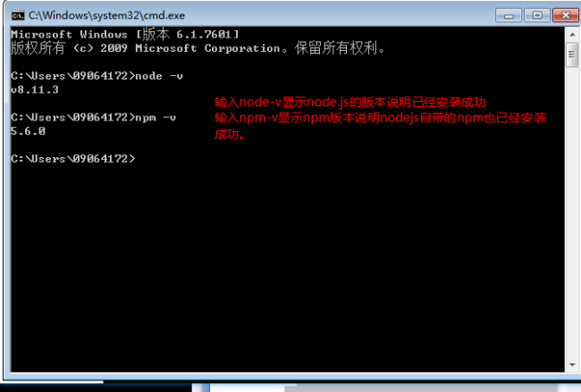<br/>
    >安装完后的目录如下图所示：<br/>
    ><br/>

    
### 2,vue-cli（vue脚手架）教程
* 1,安装vue-cli
    + 使用npm（需要安装node环境）全局安装webpack，打开命令行工具输入：npm install webpack -g或者（npm install -g webpack），安装完成之后输入 webpack -v，如下图，如果出现相应的版本号，则说明安装成功。
        > 注意：webpack 4.X 开始，需要安装 webpack-cli 依赖 ,所以使用这条命令  npm install webpack webpack-cli -g

    + 全局安装vue-cli，在cmd中输入命令:
        > npm install --global vue-cli

        <br/>
    + 安装成功：<br/>
        <br/>
    
    + 安装完成之后输入 vue -V（注意这里是大写的“V”），如下图，如果出现相应的版本号，则说明安装成功。<br/>
    <br/>
* 2,用vue-cli来构建项目
    + 我首先在D盘新建一个文件夹（vue_test）作为项目存放地，然后使用命令行cd进入到项目目录输入：<br/>
    ``` vue init webpack vue_test ```
    + vue_test是自定义的项目名称，命令执行之后，会在当前目录生成一个以该名称命名的项目文件夹。<br/>
        <br/>
        > 输入命令后，会跳出几个选项让你回答：
        > - Project name (baoge)： -----项目名称，直接回车，按照括号中默认名字（注意这里的名字不能有大写字母，如果有会报错Sorry, name can no longer contain capital letters），阮一峰老师博客[为什么文件名要小写](http://www.ruanyifeng.com/blog/2017/02/filename-should-be-lowercase.html) ，可以参考一下。
        > - Project description (A Vue.js project)： ----项目描述，也可直接点击回车，使用默认名字
        > - Author ()： ----作者，输入你的大名
        > - Runtime + Compiler: recommended for most users 运行加编译，既然已经说了推荐，就选它了
        > - Install vue-router? (Y/n) 是否安装vue-router，这是官方的路由，大多数情况下都使用，这里就输入“y”后回车即可。
        > - Use ESLint to lint your code? (Y/n) 是否使用ESLint管理代码，ESLint是个代码风格管理工具，是用来统一代码风格的，一般项目中都会使用。
        > - Setup unit tests with Karma + Mocha? (Y/n) 是否安装单元测试，我选择不安装n回车
        > - Setup e2e tests with Nightwatch(Y/n)? 是否安装e2e测试 ，我选择不安装n回车
    + 回答完毕后上图就开始构建项目了。
        - 配置完成后，可以看到目录下多出了一个项目文件夹baoge，然后cd进入这个文件夹：
            > + 安装依赖： ``` npm install ```
            >> ( 如果安装速度太慢。可以安装淘宝镜像，打开命令行工具，输入：npm install -g cnpm --registry=https://registry.npm.taobao.org然后使用cnpm来安装 或者使用nrm工具切换npm镜像)<br/>
            > + npm install ：安装所有的模块，如果是安装具体的哪个个模块，在install 后面输入模块的名字即可。而只输入install就会按照项目的根目录下的package.json文件中依赖的模块安装（这个文件里面是不允许有任何注释的），每个使用npm管理的项目都有这个文件，是npm操作的入口文件。因为是初始项目，还没有任何模块，所以我用npm install 安装所有的模块。安装完成后，目录中会多出来一个node_modules文件夹，这里放的就是所有依赖的模块。<br/>

        - 然后现在，baoge文件夹里的目录是这样的：<br/>
        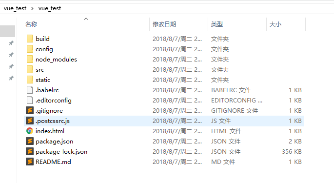<br/>
        - 解释下每个文件夹代表的意思(仔细看一下这张图）：<br/>
        <br/>
* 3,用vue-cli来构建项目<br/>
    ``` npm run dev ```
    > 之后出现 ``` I  Your application is running here: http://localhost:8080 ```
    > 则表示编译成功<br/>
    > 浏览器打开``` http://localhost:8080 ``` 即可<br/>
    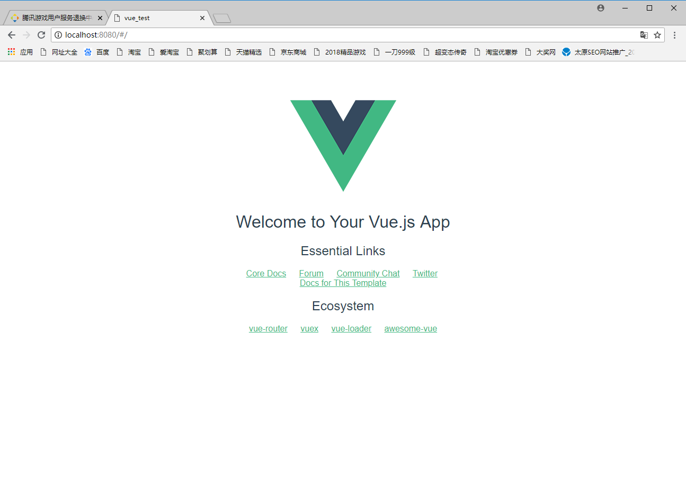<br/>
* 4,打包上线
    > 注意，自己的项目文件都需要放到 src 文件夹下。在项目开发完成之后，可以输入 npm run build 来进行打包工作。<br/>
    ``` npm run build ```<br/>

    ``` 
        1.npm 开启了npm run dev以后怎么退出或关闭？
        ctrl+c
        2.--save-dev
        自动把模块和版本号添加到模块配置文件package.json中的依赖里devdependencies部分
        3. --save-dev 与 --save 的区别
        --save     安装包信息将加入到dependencies（生产阶段的依赖）
        --save-dev 安装包信息将加入到devDependencies（开发阶段的依赖），所以开发阶段一般使用它
    ```
    > 打包完成后，会生成 dist 文件夹，如果已经修改了文件路径，可以直接打开本地文件查看。项目上线时，只需要将 dist 文件夹放到服务器就行了。<br/>


## 3,VueJS前端教程
#### 3.1 vueJS基础教程
* 
    > 后续补充
#### 3.2 Vue组件通信

> 组件 (Component) 是 Vue.js 最强大的功能之一。我的理解组件就是封装起来可以重复使用的html代码，传动的多页面应用页面之间的数据传递主要是依赖URL传递，或者cookie、localStorage等方式，vue单页面应用是组件化开发，没有页面之间的数据传递，但是存在各个组件之间的数据传递。
* 组件通讯包括：父子组件之间的通信和兄弟组件之间的通信。
    - 父组件 --> 子组件
        > - 属性传递<br/>
            > 发送：父组件通过对子组件绑定一个属性，这个属性的值将会传递给子组件。<br/>
            <br/>
            > 接收：子转件通过vue实例化属性props接收父组件传递过来的数据，有两种接收的方式：<br/>
            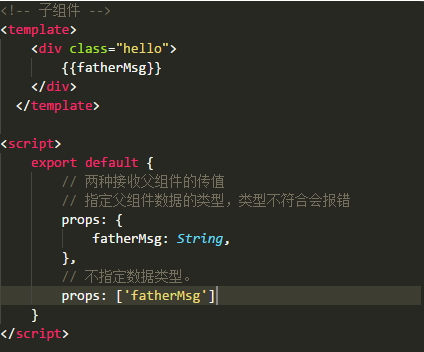<br/>
        > - 组件直接调用父组件，有两种调用，一是调用父组件$parent 二是调用根组件$root:<br/>
            > 父组件信息：<br/>
            <br/>
            > 在main.js里面定义的根组件：<br/>
            <br/>
            > 子组件获取信息：<br/>
            <br/>
    - 子组件 --> 父组件    
        > - 通过发送事件和监听事件实现
            > 发送事件（触发事件）：this.$emit(事件名，参数)；<br/>
            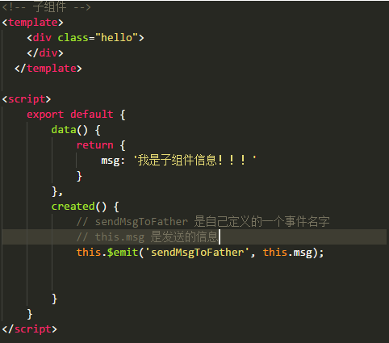<br/>
            > 监听事件（事件响应）：<br/>
            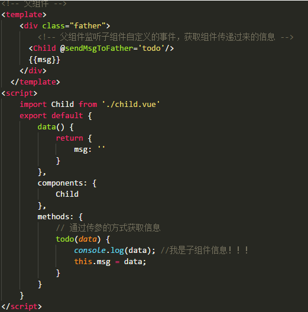<br/>
        > - 父组件直接获取子组件属性和方法<br/>
            > 我们可以给子组件起个名字。将名字设置为子组件ref属性的值；<br/>
            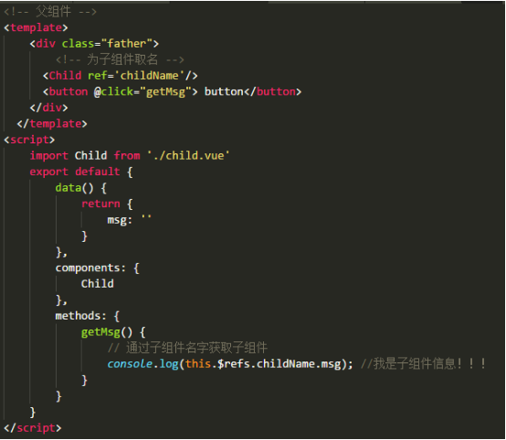<br/>
            
    > 以上都是直接父子组件的传递数据的方法；
* 全局事件总线，用来处理兄弟，祖父祖孙组件之间的通信。
    > 方法就是使用一个空的vue实例（Bus）作为全局事件总线；
    <br/>
    >各组件可自己定义好组件内接收外部组件的消息事件即可，不用理会是哪个组件发过来；而对于发送事件的组件，亦不用理会这个事件到底怎么发送给我需要发送的组件。
    > - 定义一个空的vue实例；<br/>
    <br/>
    > - 在需要用到的地方引入Bus.js；<br/>
        > 监听自定义事件<br/>
    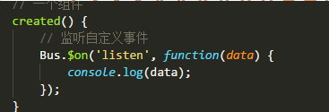<br/>
    > - 触发自定义事件<br/>
    <br/>


#### 3.3 Vuex的使用
>假设已经用vue脚手架工具构建好了项目；那么可以开始使用去引入vuex并使用它；
* 利用包管理器npm安装vuex <br/>
    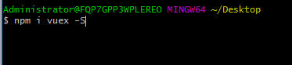<br/>
* 新建一个store.js，这个文件里面将用来存储各个组件传递的数据还有操作数据的方法；<br/>
    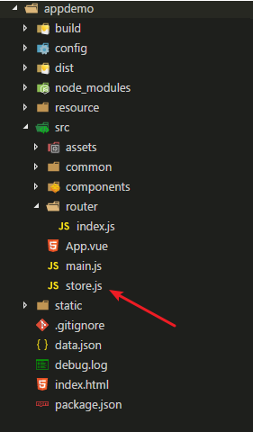<br/>
* 在store.js中输出vuex.Store对象的实例化；<br/>
    <br/>
* 之后我们在main.js中引入并且配置好我们要使用的vuex；<br/>
    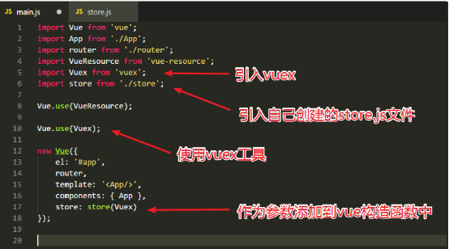<br/>
* 接下来就可以开始使用vuex了，vuex有5个核心概念分别是State，Getter，Mutation，Action，Module；
    > - A.State：<br/>
        > Vuex这个属性将会存储着各个组件可能都会用到的数据；就好像localStorage，存储的是各个页面的共享数据；
        <br/>
        > 在组件中我们可以通过this.$store.state.[数据名称]来显示这里面的数据，也可以写到computed计算属性里面：
        <br/>
        还可以通过mapState的使用更加简单来取到state里面的数据：<br/>
        <br/>
        然后只需要在计算属性里面加入：<br/>
        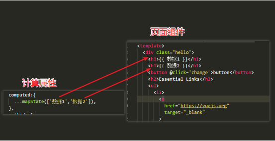<br/>
    > - Mutations：<br/>
        > Mutations意思是改变的意思，我们在操作state里面的数据的时候可以简单的使用$store.state =另外的数据；这种方法也可以达到更新页面的效果，但是vuex为我们提供更规范的写法来操作state
        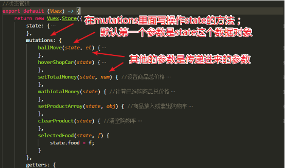<br/>
        > 之后我们是在组件上通过this.$store.commit(‘mutations里面的方法名称’)来触发相应的函数来达到更新state的目的；<br/>
        > 因为每次写this.$store.commit很浪费时间，所以vuex也提供对应的方法：mapMutations;<br/>
        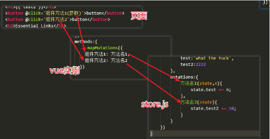<br/>
    > - Getters:<br/>
        > Getters意思是获取的意思，在vuex中的作用是在获取数据之前对数据进行加工处理后输出。<br/>
        > 基本用法：<br/>
        <br/>
        <br/>
        > 之后可以在页面上通过this.$store.getters.方法名；如果需要传参就需要this.$store.getters.方法名(参数)；<br/>
        > Getters也是有对应的mapGetters方法来简化代码：<br/>
        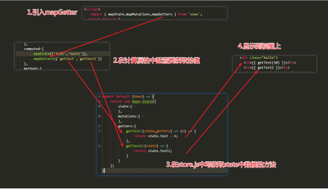<br/>
    > - Actions:<br/>
        > Actions和Mutations功能基本是一样的，但是actions是异步的改变state状态，而mutations是同步的改变状态。就是说当mutations里面的方法很复杂，执行时间久的话是会阻塞程序的运行，而actions是异步的所以就不会；<br/>
        > Actions操作的是mutation，而出发action则通过this.$store.dispatch(‘方法名’)来调用；<br/>
        <br/>
        > 通过mapActions来简化代码：<br/>
        <br/>
    > - Module:<br/>
        > Module是模块的意思，当我们的项目很大很复杂的时候，state中存储的状态也会变得非常多；<br/>
        > 使用方法：
        <br/>
        > 配置完后，其他所说的操作数据的方法都要加上模块名称：
        <br/>
> 以上就是vuex的内容！！
        
        


        
        
        

        

        
        
        
        
        

